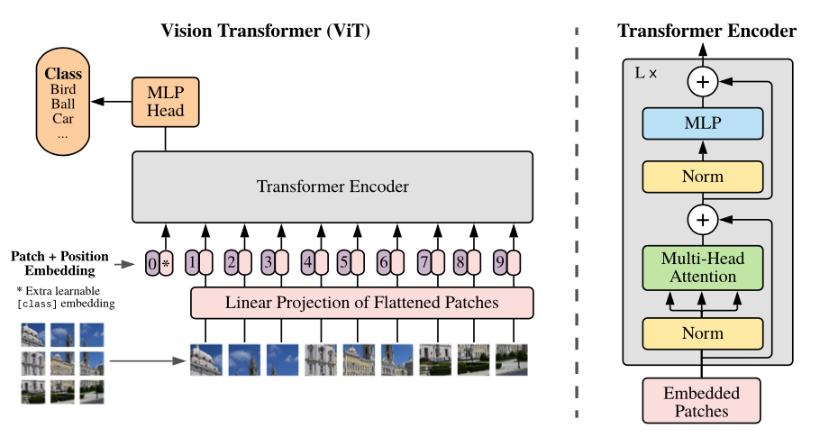
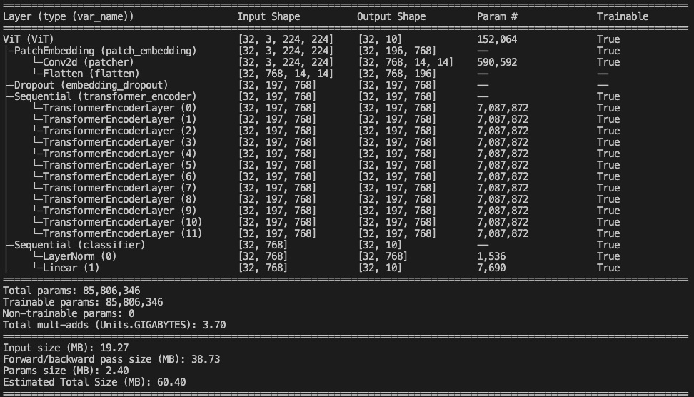

# Implementation of Vision Image Transformer (ViT)



The following code implements the paper [An Image is Worth 16x16 Words: Transformers for Image Recognition at Scale](
https://doi.org/10.48550/arXiv.2010.11929) authored by the Google Brain Team.


## ViT Model variants

| Model | Layers | Hidden size $D$ | MLP size | Heads | Params |
| :--- | :---: | :---: | :---: | :---: | :---: |
| ViT-Base | 12 | 768 | 3072 | 12 | $86M$ |
| ViT-Large | 24 | 1024 | 4096 | 16 | $307M$ |
| ViT-Huge | 32 | 1280 | 5120 | 16 | $632M$ |


## Approach Explained

- ViT is a Transformed based Image Classification model trained in supervised fashion.

- The paper experiments by applying a Standard Transformer directly on images by creating a sequence of linear embeddings (Patch Embeddings).

- The patches are treated just like words. 

- In addition to the Patch Embedding, A Class embedding and a 1D Positional Embedding is also added before passing to the Transformer.

- When giving more data to train, The models outperforms ResNet-based baselines.

- It is advised to pre-train the model on a large dataset, then fine-tune for specific tasks.

### Patch Embedding
- A `patch_size` is selected, based on which the images is then divided into appropriate `num_patches` **patches**.

- To *patchify* the image, a **2D Convolution** with zero padding, with stride, kernel of `patch_size` is used and is expanded to the required `embedding_dim`

- These **patches** are then flattened and converted into linear projections.

- Generated Embedding: `Image -> [Patch_1_Embedding, Patch_2_Embedding, ..., Patch_n, Embedding]`

### Class Embedding
- Similar to BERT, A learnable class token embedding is prepended to the Patch Embedding.
- Generated Embedding: `[Class_Embedding, Patch_1_Embedding, Patch_2_Embedding, ..., Patch_n, Embedding]`

### Positional Embedding
- Locality information is passed on by adding a **Positional embedding** to the concatenated Class + Patch Embedding. (note: size is `num_patches + 1`)

- Generated Embedding: `[Class_Embedding, Patch_1_Embedding, Patch_2_Embedding, ..., Patch_n, Embedding]` + `[Pos_0_Embedding, Pos_1_Embedding, Pos_2_Embedding, ..., Pos_n_Embedding]`

### Transformer
- A Standard Transfomer is used. Various variants are specified in the ViT paper, based on which we initialize this Transformer

- Batch Norm, Multi-Head Attention, Skip Connections, Multi Layer Percepton (MLP), GELU activation are the components used to build the Transformer Block.

- Multiple Transformer layers are stacked back-to-back.

### Classification Head
- The output of Transformer is passed into a MLP.

- The output is soft-maxed into the `num_classes`.

## Usage

### Install Dependencies from requirements.txt
```bash
pip3 install -r requirements.txt
```
Dependencies
```bash
torch
torchvision
torchinfo
tqdm
numpy
pandas
matplotlib
```

### Training
```bash
python train.py --model <model_variant> --num_epochs <number_of_epochs> --batch_size <batch_size>
```

- `model_variant`:  desired ViT variant (`base`, `large`, or `huge`). Default: base.
- `num_epochs`:  desired Epochs. Default: 10.
- `batch_size`:  desired Batch Size, Default: 32

## Torch Model Summary



## Citation
- Citing original authors for the architecture, diagrams used.
```
Dosovitskiy, A., Beyer, L., Kolesnikov, A., Weissenborn, D., Zhai, X., Unterthiner, T., Dehghani, M., Minderer, M., Heigold, G., Gelly, S., Uszkoreit, J., & Houlsby, N. (2021). "An Image is Worth 16x16 Words: Transformers for Image Recognition at Scale." arXiv preprint arXiv:2010.11929.
```

- Implementation by [mrdbourke](https://github.com/mrdbourke) is referred.
